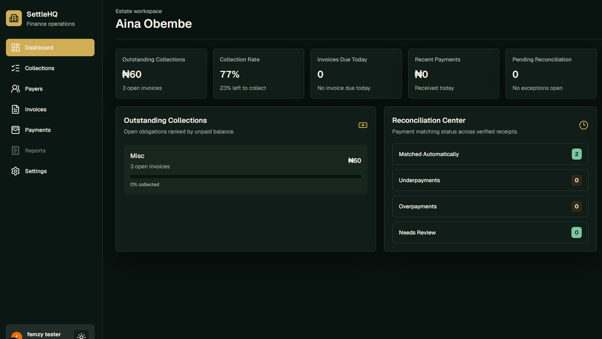
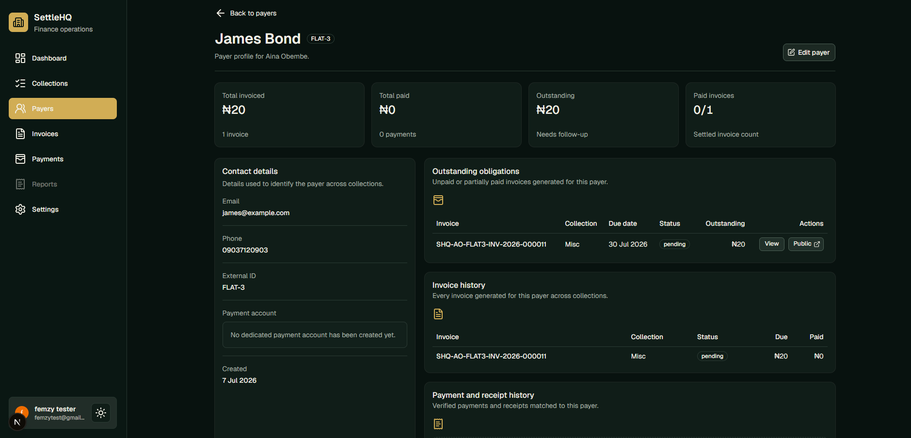
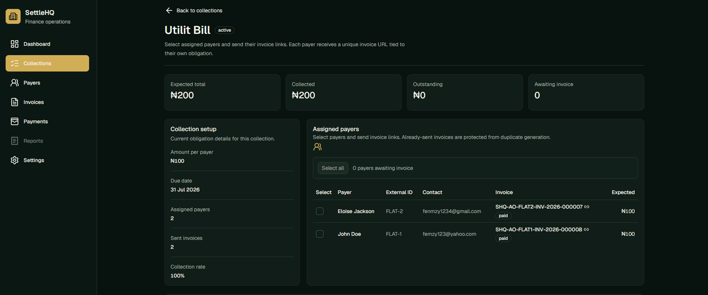
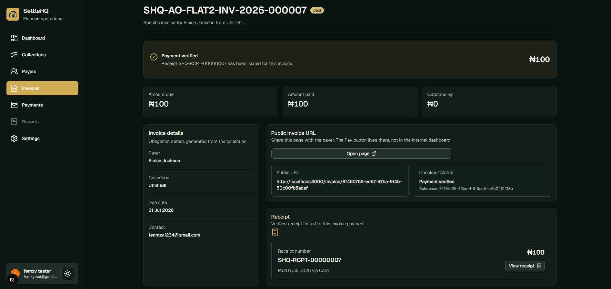

# SettleHQ

**SettleHQ** is a Nomba-powered payment collection and reconciliation platform that helps organizations create collections, issue payer-specific invoices, accept bank transfer or card payments, verify payments automatically, and generate downloadable receipts.

Instead of forcing organizations to manually track who has paid, who has not paid, which transfer belongs to which payer, and whether a receipt has been issued, SettleHQ turns every collection into a structured payment workflow.

- **Live Demo:** https://settle-hq.vercel.app/
- **GitHub Repository:** https://github.com/femzy123/settleHQ
- **Built by:** Obafemi Ogunmokun
- **Project Type:** Solo project

---

## The Problem

Many organizations collect money from multiple people but still rely on manual processes to manage the payment lifecycle.

Common examples include:

- schools collecting fees from students
- landlords collecting rent from tenants
- communities collecting dues or contributions
- businesses collecting invoices from clients
- churches, associations, or clubs collecting donations, levies, or event payments
- SMEs collecting payments from customers or vendors

The problem is not only receiving money. The bigger problem is **knowing exactly who paid, what they paid for, how much they paid, when they paid, and whether a receipt has been generated**.

In many cases, teams still reconcile payments manually by checking bank alerts, matching names, downloading statements, confirming transfers over chat, and creating receipts by hand. This creates delays, errors, poor visibility, and unnecessary operational work.

SettleHQ solves this by creating a clear collection workflow powered by Nomba APIs.

---

## What SettleHQ Does

SettleHQ allows an organization to:

1. Register and create an account.
2. Complete organization onboarding.
3. Create and manage payers.
4. Create a collection.
5. Select the payers expected to pay for that collection.
6. Generate a unique invoice URL for each payer.
7. Give each payer a unique virtual account for bank transfer payments.
8. Allow card payments through online checkout.
9. Verify payment through Nomba webhook events and transaction verification.
10. Generate a receipt after successful payment.
11. Allow the payer to download the receipt.
12. Let the organization view invoices, invoice statuses, and payments.

The core product flow is:

```txt
Organization → Payers → Collections → Invoices → Payments → Receipts
```

---

## Why Virtual Accounts as Infrastructure

SettleHQ is built primarily around the idea of **Virtual Accounts as Infrastructure**.

For every payer-specific invoice, SettleHQ creates a unique virtual account when the payer opens the invoice. This means every bank transfer can be tied to a specific payer and a specific collection.

This approach makes reconciliation much easier because payments are no longer just random inbound transfers into one shared account. Instead, every payer gets a unique account number that acts as a payment identity.

For example:

```txt
Collection: July School Fees
Payer: John Doe
Invoice: INV-001
Virtual Account: Unique to John Doe for this invoice
Payment: Bank transfer or card payment
Receipt: Generated after successful verification
```

This is valuable because the organization can instantly understand:

- which payer made the payment
- which collection the payment belongs to
- which invoice was settled
- whether the payment was completed
- whether a receipt has been generated

---

## Nomba APIs Used

SettleHQ uses Nomba as the payment infrastructure layer for the MVP. The application uses Nomba APIs in four major areas:

1. **Virtual account creation**
2. **Checkout/card payment**
3. **Webhook handling**
4. **Transaction verification and payment status updates**

---

## Judging Criteria Alignment

The challenge category for SettleHQ is centered on **Virtual Accounts as Infrastructure**. The key judging areas are reconciliation logic quality, underpayment and overpayment handling, and customer-level reporting clarity.

SettleHQ directly addresses these areas through its payer-specific invoice and virtual account workflow.

---

## Reconciliation Logic

SettleHQ's reconciliation model is built around one simple principle:

> Every invoice should be tied to a payer, every payer should receive a unique payment identity, and every successful payment should be traceable back to the correct collection.

Instead of giving all payers one shared account number, SettleHQ creates a unique virtual account for each payer's invoice when the payer opens the invoice page.

This gives the system enough context to reconcile payments automatically.

### Reconciliation Data Model

Each payment can be matched using:

- the organization
- the collection
- the payer
- the invoice
- the virtual account
- the expected amount
- the actual amount received
- the payment method
- the payment reference
- the transaction status
- the payment timestamp

This means a payment is not treated as an isolated transaction. It is connected to the full collection workflow.

```txt
Nomba Payment Event
        ↓
Virtual Account / Checkout Reference
        ↓
Invoice Match
        ↓
Payer Match
        ↓
Collection Match
        ↓
Organization Match
        ↓
Payment Status Update
        ↓
Receipt Generation
```

### Why This Reconciliation Approach Works

The unique virtual account makes reconciliation more reliable because the incoming transfer already carries payer-level context.

For bank transfers, the virtual account identifies the invoice and payer.

For card payments, the checkout transaction reference is used to connect the payment back to the invoice.

This reduces the need for manual matching based on sender name, narration, screenshots, or bank alerts.

---

## Payment Amount Handling

SettleHQ compares the **expected invoice amount** against the **actual amount received** before treating a payment as fully settled.

This is important because real-world payment collection is not always perfect. A payer may pay the exact amount, less than expected, or more than expected.

### Exact Payment

If the amount received matches the expected invoice amount, the invoice can be marked as paid.

```txt
Expected Amount = ₦50,000
Amount Received = ₦50,000
Status = Paid
Receipt = Generated
```

### Underpayment Handling

An underpayment happens when the payer sends less than the expected invoice amount.

```txt
Expected Amount = ₦50,000
Amount Received = ₦30,000
Difference = ₦20,000
Status = Underpaid / Partially Paid
Receipt = Not treated as fully settled
```

For underpaid invoices, SettleHQ keeps the invoice visible as not fully settled so the organization can clearly see that the payer has paid only part of the required amount.

This prevents the system from incorrectly marking an invoice as completed when the full amount has not been received.

### Overpayment Handling

An overpayment happens when the payer sends more than the expected invoice amount.

```txt
Expected Amount = ₦50,000
Amount Received = ₦55,000
Difference = ₦5,000
Status = Overpaid
Receipt = Generated with actual amount received
```

For overpaid invoices, SettleHQ preserves the actual amount received and makes the overpayment visible. This gives the organization a clear record of the extra amount and allows them to decide whether to refund, keep as balance, or handle it manually.

### Why Amount Matching Matters

Amount matching protects the reliability of the collection process.

Without amount comparison, a system might incorrectly mark an invoice as paid simply because some money was received. SettleHQ avoids this by checking payment status and payment amount before completing the invoice lifecycle.

---

## Customer-Level Reporting Clarity

SettleHQ is designed to make payment status clear at the payer/customer level.

The organization does not only see a total payment list. It can track payment activity by invoice and payer.

### What the Organization Can See

From the invoices and payments views, the organization can understand:

- who is expected to pay
- who has paid
- who has not paid
- which collection each payment belongs to
- which invoice each payment belongs to
- the payment method used
- the amount expected
- the amount received
- the invoice status
- the payment status
- whether a receipt has been generated

### Customer-Level View

Each payer has a clear payment trail:

```txt
Payer
  ↓
Assigned Collection
  ↓
Unique Invoice
  ↓
Unique Virtual Account / Checkout Payment
  ↓
Payment Record
  ↓
Receipt
```

This makes SettleHQ useful for organizations that need to track many payers across one or more collections.

### Example

For a school fees collection, the organization can see each student or parent as a payer and track the individual status of each invoice.

```txt
Collection: 2026 Term 1 School Fees

Payer              Expected        Received        Status
---------------------------------------------------------
John Doe           ₦50,000         ₦50,000         Paid
Mary Smith         ₦50,000         ₦30,000         Underpaid
David Johnson      ₦50,000         ₦55,000         Overpaid
Sarah Williams     ₦50,000         ₦0              Unpaid
```

This level of clarity is the main reason SettleHQ uses payer-specific invoices and virtual accounts instead of a single generic payment account.

---

## Reconciliation Statuses

SettleHQ can represent invoice and payment outcomes using clear statuses.

Common invoice/payment states include:

- **Pending**: invoice has been created but payment has not been completed
- **Paid**: expected amount has been received and verified
- **Underpaid**: amount received is less than the expected amount
- **Overpaid**: amount received is more than the expected amount
- **Failed**: payment attempt failed or could not be verified
- **Cancelled/Expired**: invoice is no longer active, where applicable

These statuses make the payment lifecycle easier for the organization to understand at a glance.

---

## Reconciliation Example

The example below shows how SettleHQ handles a typical payment event.

```txt
Collection: Office Contribution
Expected Amount: ₦10,000
Payer: Ada Johnson
Invoice ID: INV-1024
Virtual Account: Created through Nomba

Ada transfers ₦10,000 to her unique virtual account.
Nomba sends a webhook event to SettleHQ.
SettleHQ verifies the transaction.
SettleHQ matches the virtual account to Ada's invoice.
SettleHQ compares expected amount and received amount.
The amount matches.
SettleHQ marks the invoice as paid.
SettleHQ generates a receipt.
Ada can download the receipt.
The organization sees Ada as paid on the payments and invoices pages.
```

This shows the complete reconciliation loop from payment initiation to receipt generation.


---

## 1. Virtual Account API

The Virtual Account API is the core of SettleHQ.

When a payer opens their unique invoice URL, SettleHQ creates a unique virtual account for that payer's invoice. This virtual account is used for bank transfer payment.

This helps SettleHQ avoid manual reconciliation because each generated virtual account is connected to:

- the payer
- the invoice
- the collection
- the organization
- the expected amount

### How it works in SettleHQ

```txt
Payer opens invoice URL
        ↓
SettleHQ checks invoice details
        ↓
SettleHQ creates or retrieves the payer's unique virtual account
        ↓
Payer sees bank transfer details on the invoice page
        ↓
Payer transfers money into the virtual account
        ↓
Nomba sends webhook event / transaction update
        ↓
SettleHQ verifies the payment
        ↓
Invoice is marked as paid
        ↓
Receipt is generated
```

### Why this matters

This demonstrates how Nomba virtual accounts can be used beyond simple account generation. In SettleHQ, virtual accounts become a reconciliation engine for real-world organizations that collect money from many people.

---

## 2. Checkout / Card Payment

SettleHQ also supports online card payment for payers who do not want to pay by bank transfer.

On the invoice page, the payer can choose between:

- bank transfer through their unique virtual account
- online card payment through checkout

This gives payers flexibility while still keeping the collection workflow organized.

### How it works in SettleHQ

```txt
Payer opens invoice
        ↓
Payer selects card payment
        ↓
Payer is directed through the checkout/card payment flow
        ↓
Payment is processed
        ↓
Payment result is confirmed
        ↓
SettleHQ updates the invoice/payment status
        ↓
Receipt is generated after successful payment
```

### Why this matters

Some payers prefer transfers, while others prefer cards. Supporting both options makes SettleHQ more practical for real organizations and shows how Nomba can power multiple payment channels inside one product experience.

---

## 3. Webhook Handling

SettleHQ fully implements webhook handling to receive payment updates from Nomba.

Webhooks are important because payment confirmation should not depend only on the user returning to the app or refreshing a page. When Nomba sends a webhook event, SettleHQ uses that event to update the relevant invoice and payment record.

### How it works in SettleHQ

```txt
Nomba receives/processes payment event
        ↓
Nomba sends webhook to SettleHQ
        ↓
SettleHQ receives webhook payload
        ↓
SettleHQ identifies the related invoice/payment
        ↓
SettleHQ verifies the transaction/payment status
        ↓
Payment record is updated
        ↓
Invoice status is updated
        ↓
Receipt becomes available
```

### Why this matters

Webhook handling makes SettleHQ more reliable because payment status updates can happen automatically in the background.

This is important for a payment collection platform because an organization should not need to manually confirm every payment.

---

## 4. Transaction Verification

SettleHQ uses transaction verification to confirm that a payment is valid before marking an invoice as paid.

This is important because the platform should not generate a receipt only because a user claims they have paid. The system must verify the actual payment state before completing the invoice lifecycle.

### How it works in SettleHQ

```txt
Payment event is received
        ↓
SettleHQ checks transaction/payment details
        ↓
SettleHQ confirms the transaction status
        ↓
If successful:
    - payment is recorded
    - invoice is marked as paid
    - receipt is generated
If not successful:
    - invoice remains unpaid or pending
```

### Why this matters

Transaction verification protects the integrity of the payment workflow. It ensures receipts are only generated after verified payment success.

---

## End-to-End User Flow

### 1. User Registration

A user signs up and logs into SettleHQ.

Authentication is handled with Clerk.

### 2. Organization Onboarding

After registration, the user completes organization onboarding. This allows SettleHQ to associate payers, collections, invoices, payments, and receipts with an organization.

### 3. Payer Creation

The organization can create multiple payers.

A payer represents the person or entity expected to make payment for a collection.

Examples of payers:

- a student
- a tenant
- a client
- a member
- a customer
- a contributor

### 4. Collection Creation

The user creates a collection.

A collection represents the reason money is being collected.

Examples:

- school fees
- rent
- event contribution
- monthly dues
- client invoice batch
- association levy

### 5. Add Payers to Collection

After creating a collection, the user selects the payers expected to pay for that specific collection.

This creates a payer-specific invoice for each selected payer.

### 6. Unique Invoice URL

Each payer gets a unique invoice URL.

The invoice page contains:

- collection name
- payer details
- organization details
- amount to pay
- invoice status
- payment options
- bank transfer details
- card payment option

### 7. Unique Virtual Account Creation

When the payer opens the invoice, SettleHQ creates a unique virtual account for that payer's invoice.

This account is used to receive bank transfer payments and make reconciliation easier.

### 8. Payment

The payer chooses a preferred payment method:

- bank transfer
- online card payment

### 9. Verification

After payment, SettleHQ verifies the transaction through Nomba payment events and transaction verification.

### 10. Receipt Generation

Once payment is verified, SettleHQ generates a receipt.

The payer can download the receipt using the system print dialog.

### 11. Organization Payment Visibility

The organization can view all payments from the Payments page.

The organization can also view invoices and their statuses from the Invoices page.

---

## Core Features

### Organization Onboarding

Users can create and set up their organization after registration.

### Payer Management

Users can create and manage multiple payers.

### Collection Management

Users can create collections and assign payers to each collection.

### Payer-Specific Invoices

Each payer assigned to a collection receives a unique invoice URL.

### Bank Transfer Payment

Each invoice can generate a unique virtual account for bank transfer payment.

### Card Payment

Payers can pay online using the card payment option.

### Webhook-Based Payment Updates

Nomba webhook events are handled to keep payment and invoice statuses updated.

### Transaction Verification

Payments are verified before invoices are marked as paid.

### Receipt Generation

Receipts are generated after successful payment verification and can be downloaded through the system print dialog.

### Payments Page

Organizations can view all payments in one place.

### Invoices Page

Organizations can view invoices and monitor their payment status.

---

## Product Pages

The MVP includes the following major pages:

- Landing page
- Authentication pages
- Organization onboarding
- Dashboard
- Payers page
- Collections page
- Collection details page
- Invoice page
- Payments page
- Receipts page

The Reports page was intentionally skipped for the hackathon MVP to keep the scope focused and achievable.

---

## Hackathon Scope Decisions

Because the timeline was short, the MVP was intentionally scoped down to the features that best demonstrate the core payment infrastructure idea.

The following were intentionally skipped:

- Zod validation
- Sentry monitoring
- Reports page
- Advanced organization roles
- Multi-branch support
- Subscription billing
- Advanced analytics

The focus was to build a working payment collection flow around Nomba's payment infrastructure.

---

## Tech Stack

SettleHQ was built with:

- **Next.js** for the application framework
- **TypeScript** for type-safe development
- **Tailwind CSS** for styling
- **shadcn/ui** for UI components
- **Clerk** for authentication
- **Neon Postgres** for the database
- **Drizzle ORM** for database access
- **Nomba APIs** for virtual accounts, checkout/card payments, webhooks, and transaction verification
- **Vercel** for deployment

---

## How SettleHQ Helps Organizations

SettleHQ gives organizations a simpler way to manage payment collection.

Without SettleHQ, an organization may need to:

- send account details manually
- ask payers to send proof of payment
- manually confirm transfers
- manually match payments to people
- update spreadsheets
- manually issue receipts
- follow up with unpaid payers without a clear system

With SettleHQ, the organization gets:

- structured collections
- payer-specific invoices
- unique virtual accounts
- automatic payment verification
- clear invoice statuses
- centralized payment visibility
- receipt generation after payment

---

## How SettleHQ Helps Nomba

SettleHQ shows how Nomba can power more than individual payment transactions.

It demonstrates Nomba as infrastructure for:

- organization-level collections
- payer-specific reconciliation
- invoice-based payment workflows
- automated payment status updates
- virtual account-driven payment tracking
- card and transfer payment flexibility

This kind of product can help Nomba reach organizations that need more than a payment button. These organizations need operational payment tools built on top of reliable financial infrastructure.

SettleHQ positions Nomba as the backend infrastructure behind real-world financial workflows.

### Potential value to Nomba

SettleHQ can help increase:

- virtual account usage
- checkout/card payment usage
- transaction volume
- webhook-driven integrations
- adoption among SMEs and community-based organizations
- developer confidence in Nomba's APIs
- visibility into practical use cases for virtual accounts

It also shows how developers can build vertical or horizontal fintech products on top of Nomba APIs.

---

## Example Use Cases

### School Fees Collection

A school creates a collection for a term's fees, adds students as payers, and sends each student or parent a unique invoice link. Each student gets a unique virtual account for transfer payment.

### Rent Collection

A landlord creates a monthly rent collection, adds tenants, and tracks which tenants have paid.

### Community Contributions

An association creates a contribution collection, adds members, and monitors payment progress.

### Client Invoice Collection

A business creates a collection for client payments, sends each client a unique invoice, and receives verified payments.

### Event Payment Collection

An event organizer creates a collection for attendees or vendors and tracks payment status from one dashboard.

---

## Screenshots


### Dashboard



### Payers Page



### Collection Details Page



### Invoice Page



---

## MVP Limitations

SettleHQ is a hackathon MVP, so some features are not yet included.

Current limitations:

- No reports page
- No advanced analytics
- No multi-user organization roles
- No branch/location management
- No subscription billing
- No advanced payer segmentation
- No advanced retry/reminder system
- No custom receipt branding beyond the MVP design

---

## Future Improvements

Future versions of SettleHQ could include:

- automated payer reminders
- collection analytics
- organization roles and permissions
- branch support
- CSV import for payers
- bulk invoice sending
- email notifications
- advanced receipt customization
- settlement reporting
- partial payment handling
- overpayment and underpayment handling
- advanced reconciliation dashboard
- exportable reports
- SMS notifications
- recurring collections

---

## Why This Project Matters

SettleHQ is not just a payment form. It is a payment operations workflow.

The main idea is simple:

> Every payer should have a clear invoice, every payment should be verifiable, and every successful payment should produce a receipt.

By combining virtual accounts, checkout payments, webhooks, and transaction verification, SettleHQ shows how Nomba APIs can power a practical payment collection system for real organizations.

---

## Final Summary

SettleHQ helps organizations move from manual payment tracking to structured, automated payment collection.

It uses Nomba APIs to create payer-specific virtual accounts, support card payments, verify payment status, update invoices, and generate receipts.

The result is a cleaner payment experience for payers and a better reconciliation workflow for organizations.

**SettleHQ turns payment collection into a structured, trackable, and verifiable process.**
